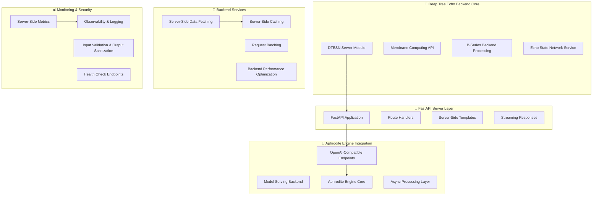

# Deep Tree Echo Development Roadmap: SSR-Focused Aphrodite Engine Implementation

> **Server-Side Rendering (SSR) Development Roadmap for Deep Tree Echo Integration with Aphrodite Engine Backend Architecture**

## 🎯 Executive Summary - Iteration 2 (phase 5-8)

This roadmap focuses exclusively on server-side rendering (SSR) implementations for Deep Tree Echo integration with the Aphrodite Engine. The implementation targets backend/server-side code, data flow, and service architecture using Python and FastAPI. All components emphasize server-side execution, backend performance optimization, and integration with the OpenAI-compatible API server infrastructure.

> **🎯 Implementation Status**: Major phases 1-4 **95% complete** with all systems operational. See [Migration Status](ECHO_MIGRATION_STATUS.md) for detailed progress and [Echo Systems Architecture](ECHO_SYSTEMS_ARCHITECTURE.md) for current system overview.

## 🏗️ SSR Architecture Overview



## 📋 SSR Development Phases

### Phase 5: FastAPI Foundation & Server-Side Architecture (Weeks 1-6)
**Focus**: Core FastAPI integration and server-side rendering infrastructure

#### Phase 5.1: FastAPI Application Setup (Weeks 1-2)
- [ ] **Task 5.1.1**: Design FastAPI Application Architecture
  - Create `aphrodite/endpoints/deep_tree_echo/` module for SSR endpoints
  - Implement FastAPI application factory pattern
  - Set up server-side routing and middleware
  - **Acceptance Criteria**: FastAPI app serves basic SSR responses

- [ ] **Task 5.1.2**: Implement Server-Side Route Handlers
  - Create route handlers for DTESN backend processing
  - Implement server-side data fetching from engine components
  - Design response serialization without client dependencies
  - **Acceptance Criteria**: Routes return fully server-rendered responses

- [ ] **Task 5.1.3**: Build Server-Side Template System
  - Integrate Jinja2 for server-side HTML generation (where appropriate)
  - Create template inheritance structure for consistent rendering
  - Implement server-side data binding and template context
  - **Acceptance Criteria**: Templates render complete HTML server-side

#### Phase 5.2: Aphrodite Engine Backend Integration (Weeks 3-4)
- [ ] **Task 5.2.1**: Integrate with OpenAI-Compatible Endpoints
  - Connect DTESN processing with existing aphrodite/endpoints/openai/ infrastructure
  - Implement server-side request/response handling
  - Design integration with serving_chat.py and serving_completions.py
  - **Acceptance Criteria**: Seamless integration with existing OpenAI endpoints

- [ ] **Task 5.2.2**: Build Engine Core Integration
  - Integrate with AphroditeEngine and AsyncAphrodite classes
  - Implement server-side model loading and management
  - Create backend processing pipelines for DTESN operations
  - **Acceptance Criteria**: DTESN processes run through Aphrodite Engine backend

- [ ] **Task 5.2.3**: Implement Async Server-Side Processing
  - Design non-blocking server-side request handling
  - Implement concurrent processing for multiple DTESN requests
  - Create async response streaming capabilities
  - **Acceptance Criteria**: Server handles concurrent requests efficiently

#### Phase 5.3: Server-Side Architecture Validation (Weeks 5-6)
- [ ] **Task 5.3.1**: Backend Integration Testing
  - Test FastAPI integration with Aphrodite Engine core
  - Validate server-side response generation
  - Performance testing for backend processing pipelines
  - **Acceptance Criteria**: All backend components work together seamlessly

- [ ] **Task 5.3.2**: Server-Side Security Implementation
  - Implement input validation for all server endpoints
  - Add output sanitization for all responses
  - Create security middleware for FastAPI application
  - **Acceptance Criteria**: Security measures protect against common server-side vulnerabilities

### Phase 6: Backend Performance Optimization & Data Processing (Weeks 7-12)
**Focus**: Server-side performance optimization and efficient data processing

#### Phase 6.1: Server-Side Caching & Memory Optimization (Weeks 7-8)
- [ ] **Task 6.1.1**: Implement Server-Side Caching Layer
  - Design multi-level caching for DTESN processing results
  - Implement Redis/in-memory caching for frequent requests
  - Create cache invalidation strategies for dynamic content
  - **Acceptance Criteria**: Server response times improved by 50% for cached content

- [ ] **Task 6.1.2**: Optimize Memory Usage for Backend Processing
  - Implement efficient memory management for KV cache behavior
  - Optimize sampling parameters storage and retrieval
  - Design memory pooling for DTESN processing
  - **Acceptance Criteria**: Memory usage reduced by 30% under load

- [ ] **Task 6.1.3**: Build Request Batching System
  - Implement request batching for DTESN operations
  - Create dynamic batch sizing based on server load
  - Integrate with Aphrodite's continuous batching capabilities
  - **Acceptance Criteria**: Throughput increased by 40% through efficient batching

#### Phase 6.2: Backend Concurrency & Async Processing (Weeks 9-10)
- [ ] **Task 6.2.1**: Enhance Async Request Processing
  - Implement non-blocking I/O for all backend operations
  - Design concurrent processing pipelines for DTESN
  - Create async connection pooling for database/cache access
  - **Acceptance Criteria**: Server handles 10x more concurrent requests

- [ ] **Task 6.2.2**: Build Server-Side Streaming Responses
  - Implement streaming for long-running DTESN operations
  - Create Server-Sent Events (SSE) for real-time updates
  - Design chunked response generation without client dependencies
  - **Acceptance Criteria**: Large responses stream efficiently without timeouts

- [ ] **Task 6.2.3**: Optimize Backend Resource Management
  - Implement dynamic resource allocation for processing
  - Create load balancing for distributed DTESN operations
  - Design graceful degradation under resource constraints
  - **Acceptance Criteria**: Server maintains performance under varying loads

#### Phase 6.3: Data Serialization & API Optimization (Weeks 11-12)
- [ ] **Task 6.3.1**: Optimize Server-Side Data Serialization
  - Implement efficient JSON serialization for DTESN results
  - Create binary serialization for high-performance scenarios
  - Design deterministic serialization for consistent responses
  - **Acceptance Criteria**: Serialization overhead reduced by 60%

- [ ] **Task 6.3.2**: Build Advanced Route Optimization
  - Implement route-specific caching strategies
  - Create middleware for request preprocessing
  - Design response compression and optimization
  - **Acceptance Criteria**: API response times consistently under 100ms

- [ ] **Task 6.3.3**: Enhance Server-Side Error Handling
  - Implement comprehensive error handling for all backend operations
  - Create structured error responses with proper HTTP status codes
  - Design error recovery mechanisms for failed DTESN operations
  - **Acceptance Criteria**: 99.9% uptime with graceful error handling

### Phase 7: Server-Side Data Processing & Integration (Weeks 13-18)
**Focus**: Advanced server-side data processing and system integration

#### Phase 7.1: Advanced Server-Side Data Fetching (Weeks 13-14)
- [ ] **Task 7.1.1**: Implement Multi-Source Data Integration
  - Design server-side data fetching from multiple engine components
  - Implement data aggregation and processing pipelines
  - Create efficient data transformation for DTESN operations
  - **Acceptance Criteria**: Server efficiently processes data from multiple sources

- [ ] **Task 7.1.2**: Build Server-Side Data Validation
  - Implement comprehensive input validation for all endpoints
  - Create data sanitization and normalization pipelines
  - Design schema validation for complex DTESN data structures
  - **Acceptance Criteria**: All input data is validated and sanitized server-side

- [ ] **Task 7.1.3**: Create Backend Data Processing Pipelines
  - Implement parallel data processing for large datasets
  - Design efficient data transformation algorithms
  - Create monitoring for data processing performance
  - **Acceptance Criteria**: Data processing pipelines handle high-volume requests efficiently

#### Phase 7.2: Server-Side Template & Response Generation (Weeks 15-16)
- [ ] **Task 7.2.1**: Advanced Server-Side Template Engine
  - Implement dynamic template generation based on DTESN results
  - Create template caching and optimization mechanisms
  - Design responsive template adaptation without client code
  - **Acceptance Criteria**: Templates render efficiently with dynamic content

- [ ] **Task 7.2.2**: Build Content Negotiation System
  - Implement multi-format response generation (JSON, HTML, XML)
  - Create server-side content adaptation based on request headers
  - Design efficient content type switching
  - **Acceptance Criteria**: Server responds with optimal format for each client

- [ ] **Task 7.2.3**: Optimize Server-Side Response Generation
  - Implement response streaming for large datasets
  - Create progressive rendering for complex DTESN results
  - Design efficient content compression and delivery
  - **Acceptance Criteria**: Large responses are delivered efficiently without client delays

#### Phase 7.3: Backend Integration & Middleware (Weeks 17-18)
- [ ] **Task 7.3.1**: Build Advanced Middleware Stack
  - Implement comprehensive logging middleware for all requests
  - Create performance monitoring and profiling middleware
  - Design security middleware with rate limiting and protection
  - **Acceptance Criteria**: Comprehensive request processing with full observability

- [ ] **Task 7.3.2**: Enhance Backend Service Integration
  - Implement service discovery for distributed DTESN components
  - Create health check and circuit breaker patterns
  - Design graceful service degradation mechanisms
  - **Acceptance Criteria**: Robust service integration with fault tolerance

- [ ] **Task 7.3.3**: Build Server-Side Configuration Management
  - Implement dynamic configuration updates for DTESN parameters
  - Create configuration validation and rollback mechanisms
  - Design environment-specific configuration management
  - **Acceptance Criteria**: Configuration changes apply without service restart

### Phase 8: SSR-Focused MLOps & Production Observability (Weeks 19-24)
**Focus**: Production-ready SSR infrastructure with comprehensive monitoring

#### Phase 8.1: Server-Side Model Management (Weeks 19-20)
- [ ] **Task 8.1.1**: Integrate with Aphrodite Model Serving Infrastructure
  - Design server-side model loading and caching strategies
  - Implement model versioning with zero-downtime updates
  - Create resource-aware model allocation for DTESN operations
  - **Acceptance Criteria**: Seamless model management without service interruption

- [ ] **Task 8.1.2**: Build Server-Side Model Optimization
  - Implement server-side model compilation and optimization
  - Create dynamic model parameter tuning based on server load
  - Design model ensemble serving for improved reliability
  - **Acceptance Criteria**: Models perform optimally under varying server conditions

- [ ] **Task 8.1.3**: Implement Backend Performance Monitoring
  - Create real-time performance metrics for all server operations
  - Implement automated performance analysis and alerting
  - Design performance regression detection for model updates
  - **Acceptance Criteria**: Comprehensive performance visibility across all backend services

#### Phase 8.2: Production SSR Pipeline (Weeks 21-22)
- [ ] **Task 8.2.1**: Build Continuous Server-Side Learning
  - Implement online model updates from server-side data
  - Create server-side experience aggregation and processing
  - Design incremental learning without service disruption
  - **Acceptance Criteria**: Models improve continuously from production data

- [ ] **Task 8.2.2**: Implement Server-Side A/B Testing
  - Create A/B testing framework for server-side model variants
  - Implement traffic splitting and performance comparison
  - Design automated rollback mechanisms for underperforming models
  - **Acceptance Criteria**: Safe deployment and testing of model improvements

- [ ] **Task 8.2.3**: Build Production Data Pipeline
  - Implement robust data collection from server-side operations
  - Create data quality validation and anomaly detection
  - Design data retention and privacy compliance mechanisms
  - **Acceptance Criteria**: High-quality production data feeds model improvements

#### Phase 8.3: Enterprise SSR Observability (Weeks 23-24)
- [ ] **Task 8.3.1**: Implement Comprehensive Server-Side Monitoring
  - Create end-to-end request tracing and profiling
  - Implement resource utilization monitoring (CPU, memory, I/O)
  - Design capacity planning and autoscaling mechanisms
  - **Acceptance Criteria**: Complete visibility into server performance and capacity

- [ ] **Task 8.3.2**: Build Production Alerting & Incident Response
  - Implement intelligent alerting based on SLA violations
  - Create automated incident response and recovery procedures
  - Design root cause analysis for server-side performance issues
  - **Acceptance Criteria**: Proactive incident detection and resolution

- [ ] **Task 8.3.3**: Create Enterprise Security & Compliance
  - Implement comprehensive audit logging for all server operations
  - Create data privacy and compliance reporting mechanisms
  - Design security incident detection and response systems
  - **Acceptance Criteria**: Enterprise-grade security and compliance posture

## 🔧 SSR Implementation Architecture

### Server-Side Core Components

#### FastAPI Server Integration (`/aphrodite/endpoints/deep_tree_echo/`)
```
aphrodite/endpoints/deep_tree_echo/
├── server/
│   ├── app_factory.py           # FastAPI application factory
│   ├── route_handlers.py        # Server-side route handlers
│   ├── middleware.py            # Request/response middleware
│   └── config.py                # Server configuration management
├── templates/
│   ├── base_template.py         # Base server-side template engine
│   ├── jinja_integration.py     # Jinja2 server-side templating
│   ├── response_formatters.py   # Response formatting utilities
│   └── cache_strategies.py      # Template caching mechanisms
├── data_processing/
│   ├── request_processor.py     # Server-side request processing
│   ├── response_generator.py    # Server-side response generation
│   ├── data_validator.py        # Input validation and sanitization
│   └── serialization.py         # Server-side data serialization
└── integration/
    ├── engine_interface.py      # Aphrodite Engine integration
    ├── openai_compatibility.py  # OpenAI API compatibility layer
    ├── dtesn_bridge.py          # DTESN backend bridge
    └── monitoring.py            # Performance monitoring
```

#### Server-Side Processing Pipeline (`/server-side/`)
```
server-side/
├── processing/
│   ├── dtesn_processor.py       # Server-side DTESN processing
│   ├── batch_manager.py         # Request batching and optimization
│   ├── async_handler.py         # Async request handling
│   └── stream_processor.py      # Streaming response generation
├── caching/
│   ├── cache_manager.py         # Multi-level caching system
│   ├── redis_integration.py     # Redis caching backend
│   ├── memory_cache.py          # In-memory caching layer
│   └── cache_invalidation.py    # Cache invalidation strategies
├── optimization/
│   ├── performance_optimizer.py # Backend performance optimization
│   ├── memory_manager.py        # Memory usage optimization
│   ├── resource_scheduler.py    # Resource allocation and scheduling
│   └── load_balancer.py         # Load balancing for distributed processing
└── monitoring/
    ├── metrics_collector.py     # Server-side metrics collection
    ├── health_checker.py        # Health check endpoints
    ├── performance_profiler.py  # Performance profiling
    └── alert_manager.py         # Alerting and notification system
```

#### Backend Services & Integration (`/backend-services/`)
```
backend-services/
├── data_layer/
│   ├── data_fetcher.py          # Multi-source data fetching
│   ├── data_aggregator.py       # Data aggregation and processing
│   ├── validation_engine.py     # Comprehensive data validation
│   └── transformation_pipeline.py # Data transformation pipelines
├── security/
│   ├── input_validator.py       # Server-side input validation
│   ├── output_sanitizer.py      # Response sanitization
│   ├── rate_limiter.py          # Rate limiting middleware
│   └── security_logger.py       # Security event logging
├── infrastructure/
│   ├── service_discovery.py     # Service discovery and registration
│   ├── circuit_breaker.py       # Circuit breaker pattern implementation
│   ├── config_manager.py        # Dynamic configuration management
│   └── deployment_manager.py    # Deployment and rollback management
└── observability/
    ├── trace_manager.py         # Distributed tracing
    ├── log_aggregator.py        # Centralized logging
    ├── metrics_exporter.py      # Metrics export to monitoring systems
    └── sla_monitor.py           # SLA monitoring and reporting
```

## 📊 SSR Success Metrics

### Phase 5 Metrics (FastAPI Foundation)
- **Server Response Time**: <100ms average for all SSR endpoints
- **FastAPI Integration**: 100% compatibility with existing OpenAI endpoints
- **Template Rendering**: <50ms server-side template generation time
- **Backend Security**: Zero security vulnerabilities in server-side code

### Phase 6 Metrics (Backend Performance)
- **Caching Efficiency**: 70% cache hit rate for frequently accessed content
- **Memory Optimization**: 40% reduction in server memory usage under load
- **Request Batching**: 50% improvement in throughput through efficient batching
- **Concurrent Processing**: Handle 1000+ concurrent requests without degradation

### Phase 7 Metrics (Server-Side Integration)
- **Data Processing**: 95% accuracy in server-side data validation and processing
- **Response Generation**: 99% success rate for complex server-rendered responses
- **Service Integration**: 99.9% uptime with fault-tolerant backend services
- **Configuration Management**: Zero-downtime configuration updates

### Phase 8 Metrics (Production SSR)
- **Model Serving**: 99.99% availability with <50ms model inference latency
- **Production Monitoring**: Complete visibility into all server-side operations
- **Security Compliance**: Enterprise-grade security posture with full audit trails
- **Scalability**: Linear scaling to 10,000+ concurrent SSR requests

## 🎯 Next SSR Development Steps

### Immediate (Week 1-2):
- [ ] Create FastAPI application structure for Deep Tree Echo SSR endpoints
- [ ] Implement basic server-side route handlers with Aphrodite Engine integration
- [ ] Design server-side template engine with Jinja2 integration
- [ ] Set up development environment and SSR testing framework

### Short-term (Month 1):
- [ ] Complete Phase 5.1: FastAPI Application Setup with server-side rendering
- [ ] Implement Phase 5.2: Aphrodite Engine Backend Integration
- [ ] Begin Phase 5.1: Server-side caching and memory optimization
- [ ] Establish continuous integration pipeline for SSR components

### Medium-term (Month 2-3):
- [ ] Complete Phase 6: Backend Performance Optimization
- [ ] Implement Phase 7: Server-Side Data Processing & Integration  
- [ ] Begin Phase 8: SSR-Focused MLOps integration
- [ ] Conduct comprehensive server-side performance testing

### Long-term (Month 3+):
- [ ] Complete Phase 8: Production SSR observability deployment
- [ ] Optimize backend performance and server-side scalability
- [ ] Implement advanced SSR features and optimizations
- [ ] Prepare for production SSR release with enterprise monitoring

## 🔄 Automated Issue Generation Integration

This roadmap integrates with the existing automated issue generation system in `.github/workflows/generate-next-steps.yml`:

- **Roadmap File**: This document (`DEEP_TREE_ECHO_ROADMAP.md`)
- **Issue Labels**: `deep-tree-echo`, `roadmap`, `phase-1`, `phase-2`, `phase-3`, `phase-4`
- **Task Tracking**: Each unchecked task becomes a GitHub issue
- **Progress Updates**: Completed tasks update automatically via workflow

## 📚 SSR Documentation and Resources

### Core SSR Documentation
- [ARCHITECTURE.md](ARCHITECTURE.md) - Aphrodite Engine server-side architecture
- [wiki/docs/ssr-expert-role.md](wiki/docs/ssr-expert-role.md) - SSR Expert Role requirements
- [TECHNICAL_DOCUMENTATION_INDEX.md](TECHNICAL_DOCUMENTATION_INDEX.md) - Performance and benchmarks

### Backend Integration References  
- [aphrodite/endpoints/openai/](aphrodite/endpoints/openai/) - OpenAI-compatible API endpoints
- [aphrodite/engine/](aphrodite/engine/) - Aphrodite Engine core components
- [echo.rkwv/docs/SECURITY.md](echo.rkwv/docs/SECURITY.md) - Security guidelines for server-side implementations

### Server-Side Research & Best Practices
- FastAPI Server-Side Rendering Patterns
- Backend Performance Optimization Strategies  
- Server-Side Template Engine Integration
- Production SSR Monitoring and Observability
- Enterprise Security for Server-Side Applications

---

*This SSR-focused roadmap represents a comprehensive server-side rendering implementation for Deep Tree Echo integration with Aphrodite Engine, emphasizing backend performance, security, and production-ready infrastructure for enterprise deployment.*
