<h1 align="center">
🌟 Aphrodite Engine
</h1>
<h3 align="center">Breathing Life into Language</h3>

<div align="center">

[](LICENSE)
[](https://www.python.org/downloads/)
[](https://developer.nvidia.com/cuda-downloads)
[](https://aphrodite.pygmalion.chat)

</div>


## 🚀 Overview

Aphrodite Engine is a high-performance, production-ready inference engine designed to serve large language models at scale. Built on the foundation of vLLM's revolutionary PagedAttention technology, Aphrodite delivers exceptional throughput and efficiency for concurrent model inference workloads.

**Key Differentiators:**
- 🔥 **High-Performance**: Optimized CUDA kernels and efficient memory management
- 🔄 **Continuous Batching**: Advanced request batching for maximum GPU utilization  
- 🎯 **Production Ready**: Battle-tested serving infrastructure with comprehensive API compatibility
- 🔧 **Extensible**: Support for custom models, quantization schemes, and sampling methods
- 🌐 **Distributed**: Built-in support for tensor parallelism and pipeline parallelism

Developed through a collaboration between [PygmalionAI](https://pygmalion.chat) and [Ruliad](https://ruliad.co), Aphrodite powers high-scale chat platforms and API infrastructure worldwide.

> [!CAUTION]
> Development is currently happening in [#1388](https://github.com/aphrodite-engine/aphrodite-engine/pull/1388).

## 📋 Table of Contents

- [🧠 Deep Tree Echo Integration](#-deep-tree-echo-integration)
- [🚀 Automated Deployment Pipeline](#-automated-deployment-pipeline)
- [🏗️ System Architecture](#️-system-architecture)
- [🔥 News & Updates](#-news--updates)
- [✨ Key Features](#-key-features)
- [🚀 Quick Start](#-quick-start)
- [📋 Requirements](#-requirements)
- [🐳 Docker Deployment](#-docker-deployment)
- [🔧 Configuration](#-configuration)
- [🛠️ Development Workflow & Contribution Guide](#️-development-workflow--contribution-guide)
- [📊 Performance & Benchmarks](#-performance--benchmarks)
- [💡 Key Optimizations](#-key-optimizations)
- [📚 Documentation](#-documentation)
- [🤝 Contributing](#-contributing)
- [🔗 Community & Support](#-community--support)
- [🙏 Acknowledgements](#-acknowledgements)

## 🧠 Deep Tree Echo Integration

> **Next-Generation Embodied AI Architecture**

This repository features an advanced integration of **Deep Tree Echo Membrane Computing** with the Aphrodite Engine, implementing a comprehensive 4E Embodied AI framework with Echo-Self AI Evolution Engine and Agent-Arena-Relation (AAR) orchestration.

### 🌐 Comprehensive Echo Systems Integration

```mermaid
graph TB
    subgraph "🧠 Aphrodite Engine Core"
        AE[Aphrodite Engine]
        API[OpenAI Compatible API]
        ModelServ[Model Serving]
        DistComp[Distributed Computing]
    end
    
    subgraph "🌳 Echo.Dash - Cognitive Architecture Hub"
        ED[Deep Tree Echo Core]
        MigSys[Migration System]
        CogGram[Cognitive Grammar Kernel]
        APIStd[API Standardization]
    end
    
    subgraph "💭 Echo.Dream - Agent-Arena-Relation"
        AAR[Agent-Arena-Relation Core]
        RecSelf[Recursive Self-Modification]
        HyperG[Hypergraph Evolution]
        DistAtten[Distributed Attention]
    end
    
    subgraph "📁 Echo.Files - Resource Management"
        ECAN[ECAN Resource Allocation]
        JuliaCore[Julia DTESN Core]
        PMemb[P-Lingua Membranes]
        ResAlloc[Resource Orchestration]
    end
    
    subgraph "🔧 Echo.Kern - DTESN Kernel"
        DTESNKern[DTESN Kernel]
        RTProc[Real-time Processing]
        NeuroHAL[Neuromorphic HAL]
        PerfTest[Performance Validation]
    end
    
    subgraph "🌐 Echo.RKWV - Production Deployment"
        RWKV[RWKV Integration]
        WebVM[WebVM Deployment]
        Microserv[Microservices Architecture]
        Monitor[Monitoring & Analytics]
    end
    
    subgraph "🔄 Echo.Self - AI Evolution Engine"
        EvoEng[Evolution Engine]
        MetaLearn[Meta-Learning]
        NeuralSymb[Neural-Symbolic Bridge]
        AdaptArch[Adaptive Architecture]
    end
    
    %% Core Integration Flows
    AE --> ED
    AE --> AAR
    AE --> ECAN
    AE --> DTESNKern
    AE --> RWKV
    AE --> EvoEng
    
    %% Cross-System Integration
    ED --> AAR
    AAR --> ECAN
    ECAN --> DTESNKern
    DTESNKern --> RWKV
    RWKV --> EvoEng
    EvoEng --> ED
    
    %% Feedback Loops
    DTESNKern -.-> EvoEng
    EvoEng -.-> AAR
    AAR -.-> ED
    
    style AE fill:#e1f5fe
    style ED fill:#f3e5f5
    style AAR fill:#e8f5e8
    style ECAN fill:#fff3e0
    style DTESNKern fill:#ffebee
    style RWKV fill:#f9fbe7
    style EvoEng fill:#fce4ec
```

### 🌟 Echo Systems Overview

The Aphrodite Engine integrates **six specialized Echo systems** that collectively provide advanced cognitive capabilities:

| System | Purpose | Status | Key Features | Integration Points |
|--------|---------|--------|-------------|-------------------|
| 🌳 **Echo.Dash** | Cognitive Architecture Hub | ✅ Active | Deep Tree Echo core, migration system, API standardization | Core orchestration, API gateway |
| 💭 **Echo.Dream** | Agent-Arena-Relation | ✅ Active | Distributed cognition, recursive self-modification, hypergraph evolution | Multi-agent coordination, simulation |
| 📁 **Echo.Files** | Resource Management | ✅ Active | ECAN allocation, Julia DTESN cores, P-Lingua membranes | Memory management, resource allocation |
| 🔧 **Echo.Kern** | DTESN Kernel | ✅ Active | Real-time processing, neuromorphic HAL, performance validation | Hardware abstraction, real-time processing |
| 🌐 **Echo.RKWV** | Production Deployment | ✅ Active | WebVM integration, microservices, monitoring (2500+ req/min) | Production serving, scalability |
| 🔄 **Echo.Self** | AI Evolution Engine | ✅ Active | Adaptive architecture, meta-learning, neural-symbolic bridge | Self-optimization, evolution |

### 🎯 4E Embodied AI Framework Components

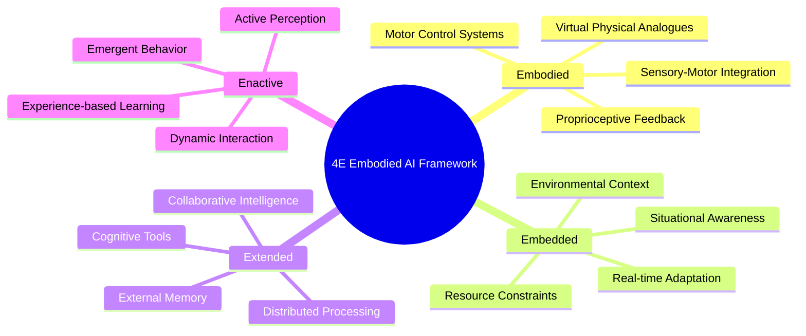

**📋 Complete Documentation**: [Echo Systems Architecture Overview](ECHO_SYSTEMS_ARCHITECTURE.md)

### 🎯 Key Integration Components

- **Echo-Self AI Evolution Engine**: Self-optimizing neural architectures through genetic algorithms
- **Agent-Arena-Relation (AAR)**: Multi-agent orchestration and simulation environments  
- **4E Embodied AI Framework**: Embodied, Embedded, Extended, and Enactive artificial intelligence
- **DTESN Kernel**: Deep Tree Echo State Networks with P-System membrane computing
- **Sensory-Motor Integration**: Virtual sensory analogues with proprioceptive feedback loops
- **Dynamic MLOps**: Real-time model training and optimization pipeline

### 📚 Documentation

### 📖 Comprehensive Documentation Guide

Aphrodite Engine provides extensive documentation covering all aspects of the system, from basic usage to advanced Deep Tree Echo integration:

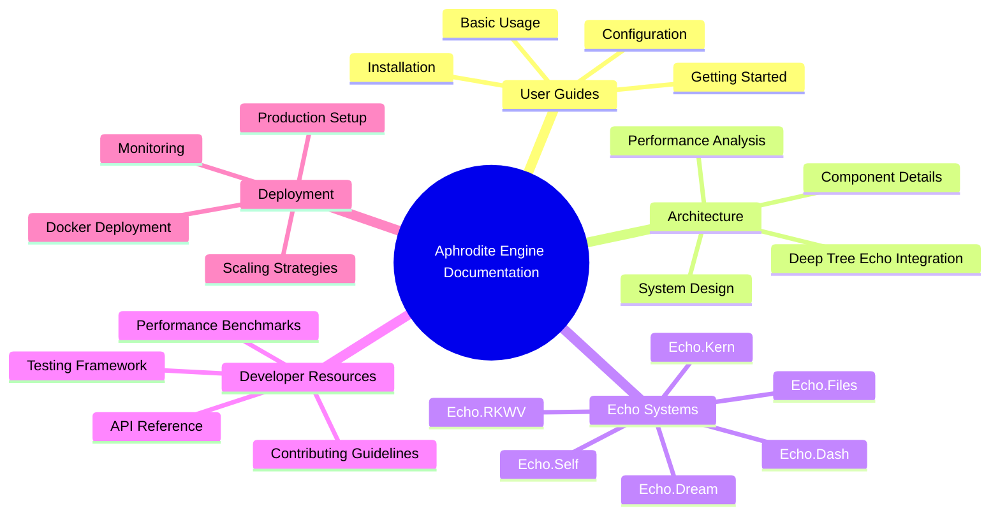

### 📋 Documentation Index

| Category | Resource | Description |
|----------|----------|-------------|
| **🚀 Getting Started** | [README.md](README.md) | Complete overview and quick start guide |
| **🏗️ Architecture** | [ARCHITECTURE.md](ARCHITECTURE.md) | Detailed technical architecture |
| **🌳 Echo Integration** | [Echo Systems Architecture](ECHO_SYSTEMS_ARCHITECTURE.md) | Deep Tree Echo integration overview |
| **📚 Complete Index** | [Technical Documentation Index](TECHNICAL_DOCUMENTATION_INDEX.md) | Comprehensive navigation guide |
| **🔧 Development** | [Contributing Guide](CONTRIBUTING.md) | Development workflow and standards |
| **📊 Performance** | [Benchmarks](docs/src/content/docs/developer/benchmarks.md) | Performance analysis and optimization |
| **🚀 Deployment** | [Deployment Guide](DEPLOYMENT.md) | Production deployment instructions |
| **🌐 API Reference** | [API Documentation](docs/src/content/docs/) | Complete API documentation |

### 🎯 Documentation Features

- **🎨 Comprehensive Mermaid Diagrams**: All architecture visualized with interactive diagrams
- **🔗 Cross-Referenced Content**: Extensive linking between related documentation
- **📱 Multi-Platform Support**: Documentation accessible across all devices
- **🔄 Live Updates**: Documentation synchronized with code changes
- **🌍 Community Driven**: Open for contributions and improvements

## 🔗 Community & Support

### 🌟 Community Ecosystem

```mermaid
graph TB
    subgraph "💬 Communication Channels"
        Discord[Discord Community<br/>Real-time Discussion]
        GitHub[GitHub Issues<br/>Bug Reports & Features]
        Docs[Documentation Site<br/>Guides & Tutorials]
        Twitter[Twitter Updates<br/>News & Announcements]
    end
    
    subgraph "🤝 Contribution Pathways"
        Code[Code Contributions<br/>Features & Fixes]
        Docs_Contrib[Documentation<br/>Guides & Examples]
        Testing[Testing & QA<br/>Bug Reports & Validation]
        Community[Community Support<br/>Help & Mentoring]
    end
    
    subgraph "🎯 Development Support"
        DevChat[Developer Chat<br/>Technical Discussions]
        CodeReview[Code Reviews<br/>Quality Assurance]
        Mentoring[Mentoring Program<br/>New Contributors]
        Workshops[Workshops & Events<br/>Learning Opportunities]
    end
    
    Discord --> Code
    GitHub --> Docs_Contrib
    Docs --> Testing
    Twitter --> Community
    
    Code --> DevChat
    Docs_Contrib --> CodeReview
    Testing --> Mentoring
    Community --> Workshops
    
    style Discord fill:#7289da
    style GitHub fill:#333
    style DevChat fill:#00d4aa
    style CodeReview fill:#f39c12
```

### 📞 Support Channels

- 💬 **Discord**: Join our [development community](https://discord.gg/pygmalion) for real-time discussions
- 📧 **GitHub Issues**: Report bugs and request features on [GitHub Issues](https://github.com/EchoCog/aphroditecho/issues)
- 📚 **Documentation**: Comprehensive guides at [aphrodite.pygmalion.chat](https://aphrodite.pygmalion.chat)
- 🐦 **Updates**: Follow [@PygmalionAI](https://twitter.com/PygmalionAI) for latest news and updates

### 🎯 Getting Help

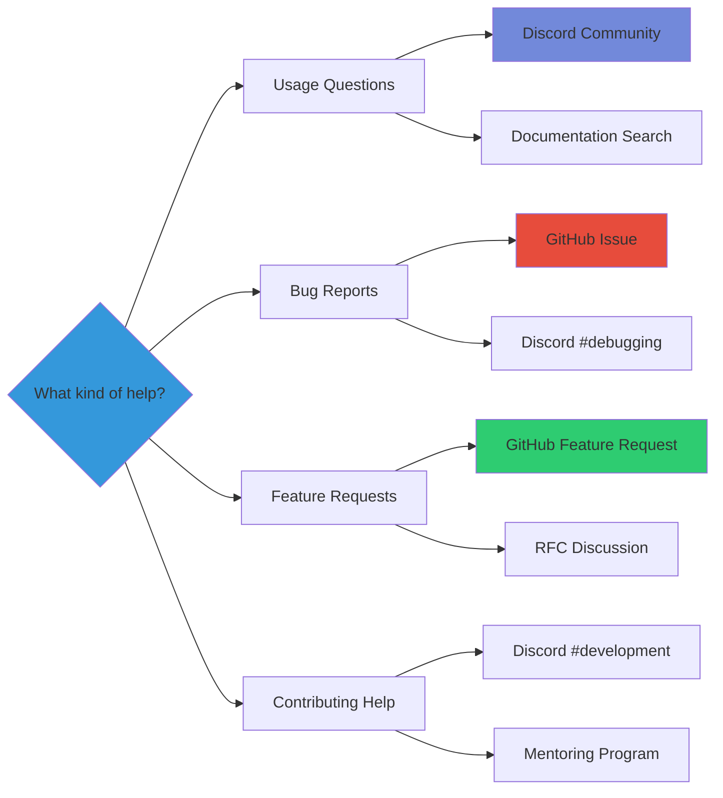

### 🤝 How to Contribute

1. **🍴 Fork & Clone**: Fork the repository and clone locally
2. **🌿 Create Branch**: Create a feature branch for your contribution
3. **💻 Develop**: Implement your changes following our guidelines
4. **🧪 Test**: Run comprehensive tests including Echo system integration
5. **📝 Document**: Update documentation for your changes
6. **🔍 Review**: Submit PR for community review
7. **🎉 Merge**: Celebrate your contribution to the ecosystem!

### 🏆 Recognition

We celebrate and recognize our contributors through:
- **🌟 Contributor Spotlights**: Monthly recognition in our newsletter
- **🏅 GitHub Achievements**: Special badges for significant contributions  
- **📢 Social Media**: Shoutouts on our official channels
- **🎪 Conference Opportunities**: Speaking opportunities at community events

### 🚀 Getting Started with Deep Tree Echo

```bash
# Enable Deep Tree Echo features
export DEEP_TREE_ECHO_ENABLED=true
export AAR_ORCHESTRATION=true
export EMBODIED_AI_FRAMEWORK=true

# Run with advanced features
aphrodite run meta-llama/Meta-Llama-3.1-8B-Instruct \
  --deep-tree-echo \
  --enable-evolution-engine \
  --aar-max-agents 1000 \
  --embodied-cognition
```

## 🚀 Automated Deployment Pipeline

**Phase 4.3.1**: Complete MLOps solution with automated model deployment, A/B testing, and quality assurance.

Aphrodite Engine includes a comprehensive automated deployment pipeline that ensures reliable model deployments with confidence:

### ✨ Key Features

- **🔍 Automated Quality Assurance**: Comprehensive pre-deployment validation
  - Model compatibility testing with Aphrodite Engine
  - Performance benchmarking against configurable thresholds
  - Security compliance validation
  - Deep Tree Echo integration verification

- **🧪 A/B Testing Framework**: Safe model version comparison
  - Configurable traffic splitting (5%, 10%, 25%, 50%)
  - Real-time metrics collection and analysis
  - Automated promotion/rollback decisions
  - Comprehensive monitoring dashboards

- **🚀 Deployment Orchestration**: Seamless multi-environment deployment
  - Progressive rollout with safety checks
  - Automatic rollback on failure detection
  - Multi-environment support (staging → production)
  - Integration with existing CI/CD workflows

- **📊 Production Monitoring**: Continuous health monitoring
  - Real-time performance metrics
  - Error rate and latency tracking
  - Resource utilization monitoring
  - Automated alerting and incident response

### 🎯 Quick Start

**Manual Deployment:**
```bash
# Trigger via GitHub Actions
# 1. Navigate to Actions → "Automated Model Deployment Pipeline"  
# 2. Click "Run workflow"
# 3. Configure deployment parameters:
#    - Environment: staging/production
#    - Model Version: latest or specific tag
#    - A/B Testing: enabled
#    - Traffic Split: 10%
```

**Automatic Deployment:**
- Push to `main` → Triggers staging deployment with A/B testing
- Create release → Triggers production deployment
- Pull request → Runs quality assurance validation

### 📋 Pipeline Workflow

```mermaid
graph LR
    QA[🔍 Quality<br/>Assurance] --> Registry[📦 Model<br/>Registry]
    Registry --> AB[🧪 A/B<br/>Testing] 
    AB --> Deploy[🚀 Automated<br/>Deployment]
    Deploy --> Monitor[📊 Production<br/>Monitoring]
    
    style QA fill:#e8f5e8
    style AB fill:#e3f2fd  
    style Deploy fill:#fff3e0
    style Monitor fill:#f3e5f5
```

### 🔧 Configuration

Key configuration files:
- `deployment/configs/pipeline-config.yaml` - Pipeline settings
- `.github/workflows/automated-deployment-pipeline.yml` - CI/CD workflow
- `deployment/scripts/` - Core deployment automation scripts

**Quality Thresholds:**
```yaml
quality_thresholds:
  minimum_score: 80
  performance:
    max_latency_ms: 200
    min_throughput_tokens_sec: 100
  security:
    require_authentication: true
    require_rate_limiting: true
```

**A/B Testing:**
```yaml
ab_testing:
  success_criteria:
    max_error_rate_increase: 0.5%
    max_latency_increase_percent: 20%
  failure_criteria:
    max_error_rate: 5.0%
    auto_rollback: true
```

📚 **Documentation**: [Complete Deployment Pipeline Guide](deployment/DEPLOYMENT_PIPELINE.md)

---

## 🏗️ System Architecture

Aphrodite Engine employs a sophisticated multi-layered architecture optimized for high-throughput LLM inference with Deep Tree Echo integration:

### 🎯 Core Architecture with Deep Tree Echo Integration

```mermaid
graph TB
    subgraph "🌐 Client Layer"
        CLI[Aphrodite CLI]
        HTTP[HTTP Clients]
        API[OpenAI API Compatible]
        ECHO_CLI[Echo.Self Interface]
    end
    
    subgraph "🚪 API Gateway & Echo Integration"
        Server[FastAPI Server]
        Auth[Authentication]
        Route[Request Routing]
        EchoRouter[Echo Systems Router]
    end
    
    subgraph "🧠 Core Engine & AAR Orchestration"
        AsyncEng[Async Aphrodite Engine]
        EngCore[Engine Core]
        Sched[Scheduler]
        AAROr[AAR Orchestrator]
    end
    
    subgraph "🔄 Processing Pipeline & Echo.Dream"
        Tokenizer[Tokenization]
        MM[Multi-Modal Processing]
        Embed[Embedding Generation]
        DreamProc[Echo.Dream Processing]
    end
    
    subgraph "⚙️ Model Execution & DTESN"
        ModelExec[Model Executor]
        KVCache[KV Cache Manager]
        Attn[Paged Attention]
        DTESNExec[DTESN Execution Layer]
    end
    
    subgraph "💾 Memory Management & Echo.Files"
        BlockMgr[Block Manager]
        GPUMem[GPU Memory Pool]
        CPUMem[CPU Memory Pool]
        ECANMem[ECAN Memory System]
    end
    
    subgraph "🔧 Hardware Layer & Echo.Kern"
        GPU[GPU Devices]
        CPU[CPU Resources]
        Network[Network I/O]
        NeuroHW[Neuromorphic Hardware]
    end
    
    subgraph "🌐 Production & Echo.RKWV"
        WebVM[WebVM Runtime]
        Monitoring[Real-time Monitoring]
        Scaling[Auto-scaling]
    end
    
    %% Client connections
    CLI --> Server
    HTTP --> Server
    API --> Server
    ECHO_CLI --> EchoRouter
    
    %% Gateway processing
    Server --> Auth
    Auth --> Route
    Route --> AsyncEng
    EchoRouter --> AAROr
    
    %% Core engine flow
    AsyncEng --> EngCore
    EngCore --> Sched
    AAROr --> Sched
    
    %% Processing pipeline
    Sched --> Tokenizer
    Tokenizer --> MM
    MM --> Embed
    Embed --> ModelExec
    DreamProc --> ModelExec
    
    %% Execution layer
    ModelExec --> KVCache
    KVCache --> Attn
    Attn --> BlockMgr
    DTESNExec --> BlockMgr
    
    %% Memory management
    BlockMgr --> GPUMem
    BlockMgr --> CPUMem
    ECANMem --> GPUMem
    ECANMem --> CPUMem
    
    %% Hardware integration
    GPUMem --> GPU
    CPUMem --> CPU
    GPU --> Network
    NeuroHW --> GPU
    
    %% Production monitoring
    GPU --> WebVM
    Network --> Monitoring
    Monitoring --> Scaling
    
    %% Echo system interconnections
    AAROr -.-> DreamProc
    DreamProc -.-> DTESNExec
    DTESNExec -.-> ECANMem
    ECANMem -.-> NeuroHW
    
    style AsyncEng fill:#e1f5fe
    style AAROr fill:#f3e5f5
    style DreamProc fill:#e8f5e8
    style DTESNExec fill:#fff3e0
    style ECANMem fill:#ffebee
    style NeuroHW fill:#f9fbe7
```

### 📊 Performance & Memory Architecture

```mermaid
graph LR
    subgraph "🔍 Memory Efficiency Pipeline"
        subgraph "Traditional Attention"
            TradInput[Input Tokens]
            TradMem[Contiguous Memory<br/>High Fragmentation]
            TradWaste[40-60% Memory Waste]
        end
        
        subgraph "Paged Attention"
            PagedInput[Input Tokens]
            PagedMem[Paged Memory Blocks<br/>Dynamic Allocation]
            PagedEff[5-10% Memory Waste]
        end
        
        subgraph "Deep Tree Echo Enhancement"
            EchoInput[Input + Context]
            DTESNMem[DTESN Memory Pools<br/>Adaptive Allocation]
            EchoOpt[<5% Memory Waste<br/>Self-Optimizing]
        end
    end
    
    TradInput --> TradMem --> TradWaste
    PagedInput --> PagedMem --> PagedEff
    EchoInput --> DTESNMem --> EchoOpt
    
    style TradWaste fill:#ff6b6b
    style PagedEff fill:#51cf66
    style EchoOpt fill:#339af0
### 🔄 Enhanced Request Processing Flow with Deep Tree Echo

```mermaid
sequenceDiagram
    participant Client
    participant APIServer
    participant EchoRouter
    participant Engine
    participant AAR
    participant Scheduler
    participant EchoDream
    participant ModelExecutor
    participant DTESNExec
    participant KVCache
    participant ECANMem
    
    Client->>APIServer: HTTP Request
    APIServer->>APIServer: Parse & Validate
    APIServer->>EchoRouter: Route to Echo Systems
    
    alt Echo.Self Request
        EchoRouter->>AAR: Agent-Arena-Relation
        AAR->>AAR: Multi-agent Coordination
        AAR->>Engine: Orchestrated Request
    else Standard Request
        APIServer->>Engine: Submit Request
    end
    
    Engine->>Scheduler: Add to Priority Queue
    Scheduler->>Scheduler: Dynamic Batch Formation
    
    par Parallel Processing
        Scheduler->>EchoDream: Cognitive Processing
        EchoDream->>EchoDream: Hypergraph Evolution
        EchoDream-->>Scheduler: Enhanced Context
    and
        Scheduler->>ModelExecutor: Execute Batch
        ModelExecutor->>DTESNExec: DTESN Processing
        DTESNExec->>DTESNExec: Echo State Networks
        DTESNExec-->>ModelExecutor: Neural State
    end
    
    ModelExecutor->>ECANMem: Allocate ECAN Memory
    ModelExecutor->>KVCache: Manage Attention Cache
    ModelExecutor->>ModelExecutor: Forward Pass
    
    ModelExecutor->>KVCache: Update Cache
    ECANMem->>ECANMem: Resource Optimization
    
    ModelExecutor-->>Scheduler: Token Generated
    DTESNExec-->>AAR: State Feedback
    AAR-->>EchoRouter: Evolution Signal
    
    Scheduler-->>Engine: Partial Output
    Engine-->>APIServer: Streaming Response
    APIServer-->>Client: SSE/JSON Response
    
    Note over AAR,DTESNExec: Deep Tree Echo enhances<br/>processing with adaptive intelligence
    Note over Scheduler,ModelExecutor: Continuous batching with<br/>cognitive enhancement
```

### 🧠 Enhanced Core Components with Echo Integration

| Component | Purpose | Key Features | Echo Enhancement |
|-----------|---------|--------------|------------------|
| **Engine Core** | Central orchestration | Request lifecycle management, async processing | AAR orchestration integration |
| **Scheduler** | Request batching & prioritization | Continuous batching, memory-aware scheduling | Cognitive priority optimization |
| **Model Executor** | Model inference execution | Optimized forward passes, distributed execution | DTESN neural processing |
| **KV Cache Manager** | Attention state management | Paged memory, efficient cache allocation | Echo.Files ECAN optimization |
| **Block Manager** | Memory allocation | GPU/CPU memory pools, dynamic allocation | Adaptive memory with Echo.Kern |
| **API Server** | HTTP interface | OpenAI-compatible REST API, streaming support | Echo.Self evolution interface |
| **AAR Orchestrator** | Multi-agent coordination | Agent arena management, recursive self-modification | Deep Tree Echo coordination |
| **Echo.Dream** | Cognitive processing | Hypergraph evolution, distributed attention | Advanced context understanding |


## 🔥 News & Updates

**🚀 Latest Release (09/2024): v0.6.1** - Advanced Quantization Support
- ⚡ Load FP16 models in ultra-low precision FP2-FP7 formats
- 🎯 Achieve 5-10x memory reduction with minimal quality loss
- 📊 Extreme throughput improvements for large model deployment

**🎉 Major Release (09/2024): v0.6.0** - Performance Revolution
- 🚄 **Massive throughput improvements** across all model sizes
- 🔧 **New quantization formats**: FP8, llm-compressor integration
- 🌐 **Asymmetric tensor parallel**: Optimized multi-GPU scaling
- 🔄 **Pipeline parallelism**: Support for models that don't fit on single nodes
- 📚 **Comprehensive documentation**: Complete user and developer guides

**🎯 Roadmap Highlights:**
- **Q4 2024**: Multi-modal model support expansion
- **Q1 2025**: Advanced reasoning capabilities
- **Q2 2025**: Edge deployment optimizations

> 💡 **Stay Updated**: Follow our [documentation](https://aphrodite.pygmalion.chat) for the latest features and optimizations!

## ✨ Key Features

### 🚄 Performance & Scalability
- **Continuous Batching**: Advanced request batching that maximizes GPU utilization
- **PagedAttention**: Efficient K/V cache management reducing memory fragmentation  
- **Optimized CUDA Kernels**: Custom kernels for improved inference performance
- **Distributed Inference**: Tensor parallelism and pipeline parallelism support
- **8-bit KV Cache**: Higher context lengths with FP8 E5M3 and E4M3 formats

### 🔧 Model Support & Quantization
- **Universal Compatibility**: HuggingFace-compatible model serving
- **Advanced Quantization**: AQLM, AWQ, Bitsandbytes, GGUF, GPTQ, QuIP#, SqueezeLLM, Marlin
- **Precision Formats**: FP2-FP12, FP8, INT4, INT8 quantization support  
- **Dynamic Loading**: Runtime model and adapter loading/unloading

### 🎛️ Advanced Sampling & Generation
- **Modern Samplers**: DRY, XTC, Mirostat, and more sophisticated sampling methods
- **Structured Output**: JSON, grammar-guided generation support
- **Multi-Modal**: Vision, audio, and text processing capabilities
- **Tool Integration**: Function calling and tool use support

### 🌐 Production Features  
- **OpenAI API Compatibility**: Drop-in replacement for OpenAI API
- **Streaming Support**: Server-sent events and WebSocket streaming
- **Robust Authentication**: API key management and rate limiting
- **Comprehensive Monitoring**: Prometheus metrics and health checks

### 📊 Architecture Highlights

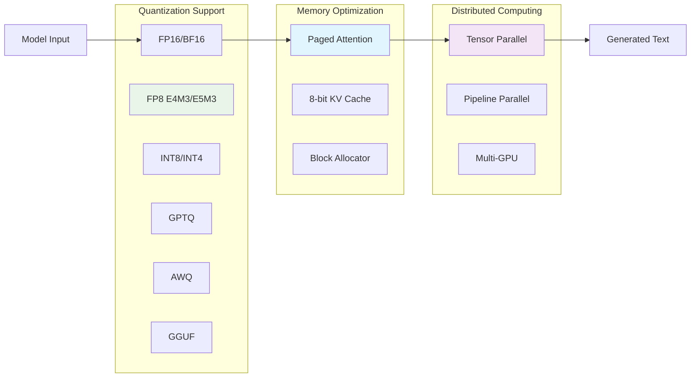


## 🚀 Quick Start

### 📦 Installation

Install the engine with all dependencies:

```bash
pip install -U aphrodite-engine --extra-index-url https://downloads.pygmalion.chat/whl
```

### 🏃‍♂️ Launch Your First Model

Start serving a model with a single command:

```bash
aphrodite run meta-llama/Meta-Llama-3.1-8B-Instruct
```

**💡 Memory Optimization**: For non-production use, add `--single-user-mode` to limit memory allocation.

This creates an [OpenAI-compatible API](https://platform.openai.com/docs/api-reference/) server accessible at `http://localhost:2242`.

### 🔌 API Usage Example

```python
import openai

# Configure client to use Aphrodite
client = openai.OpenAI(
    base_url="http://localhost:2242/v1",
    api_key="sk-empty"  # Not required for local deployment
)

# Generate text
response = client.chat.completions.create(
    model="meta-llama/Meta-Llama-3.1-8B-Instruct",
    messages=[
        {"role": "user", "content": "Explain quantum computing in simple terms."}
    ],
    max_tokens=150,
    temperature=0.7
)

print(response.choices[0].message.content)
```

### 🎮 Interactive Demo

Try Aphrodite Engine in your browser:

[](https://colab.research.google.com/github/AlpinDale/misc-scripts/blob/main/Aphrodite.ipynb)

### 📖 Complete Documentation

For advanced configuration, deployment options, and API reference:
**[📚 Visit Full Documentation](https://aphrodite.pygmalion.chat)**

## 🐳 Docker Deployment

### 🚀 Quick Docker Setup

Pull and run the pre-built Docker image:

```bash
docker run --runtime nvidia --gpus all \
    -v ~/.cache/huggingface:/root/.cache/huggingface \
    -p 2242:2242 \
    --ipc=host \
    alpindale/aphrodite-openai:latest \
    --model NousResearch/Meta-Llama-3.1-8B-Instruct \
    --api-keys "your-api-key-here"
```

### 🏗️ Multi-GPU Configuration

For distributed inference across multiple GPUs:

```bash
docker run --runtime nvidia --gpus all \
    -v ~/.cache/huggingface:/root/.cache/huggingface \
    -e "CUDA_VISIBLE_DEVICES=0,1,2,3" \
    -p 2242:2242 \
    --ipc=host \
    alpindale/aphrodite-openai:latest \
    --model meta-llama/Meta-Llama-3.1-70B-Instruct \
    --tensor-parallel-size 4 \
    --api-keys "your-api-key"
```

### 📊 Docker Architecture

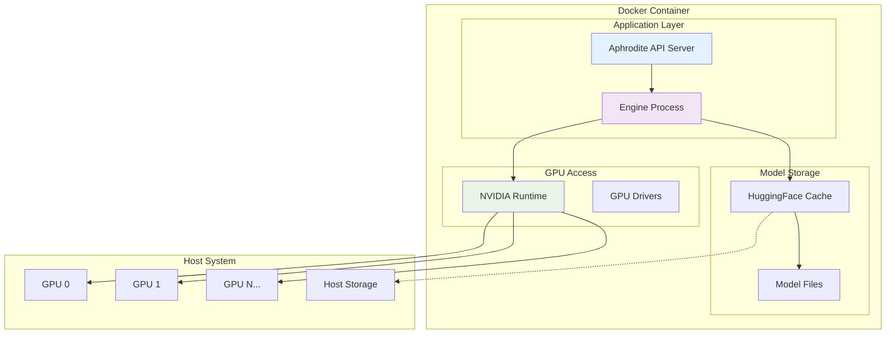

## 🔧 Configuration

### ⚙️ Essential Parameters

| Parameter | Description | Example |
|-----------|-------------|---------|
| `--model` | HuggingFace model path | `meta-llama/Llama-2-7b-hf` |
| `--tensor-parallel-size` | Number of GPUs for model | `4` |
| `--max-model-len` | Maximum sequence length | `4096` |
| `--gpu-memory-utilization` | GPU memory usage (0.0-1.0) | `0.9` |
| `--quantization` | Quantization method | `awq`, `gptq`, `fp8` |

### 🎛️ Advanced Configuration

```bash
# Production deployment with optimizations
aphrodite run meta-llama/Meta-Llama-3.1-8B-Instruct \
    --host 0.0.0.0 \
    --port 2242 \
    --tensor-parallel-size 2 \
    --max-model-len 8192 \
    --gpu-memory-utilization 0.95 \
    --disable-log-requests \
    --quantization fp8 \
    --kv-cache-dtype fp8 \
    --api-keys "sk-your-key-here"
```

### 📈 Performance Tuning

```mermaid
flowchart LR
    subgraph "Memory Optimization"
        A[GPU Memory<br/>Utilization] --> B[KV Cache<br/>Quantization]
        B --> C[Block Size<br/>Tuning]
    end
    
    subgraph "Compute Optimization"  
        D[Tensor<br/>Parallelism] --> E[CUDA<br/>Kernels]
        E --> F[Mixed<br/>Precision]
    end
    
    subgraph "Scheduling"
        G[Batch Size<br/>Optimization] --> H[Continuous<br/>Batching]
        H --> I[Request<br/>Prioritization]
    end
    
    C --> D
    F --> G
    I --> Performance[🚀 Optimal<br/>Performance]
    
    style Performance fill:#4caf50
```

## 📋 Requirements

### 🖥️ System Requirements
- **Operating System**: Linux (recommended), Windows (build from source)
- **Python Version**: 3.9 to 3.12
- **CUDA**: Version 12.0 or higher

### 🎯 Supported Hardware

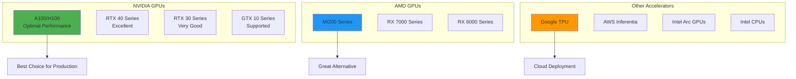

### 💾 Memory Requirements

| Model Size | Minimum VRAM | Recommended VRAM | Context Length |
|------------|---------------|------------------|----------------|
| 7B params | 8 GB | 16 GB | 4K-32K tokens |
| 13B params | 16 GB | 24 GB | 4K-32K tokens |
| 34B params | 24 GB | 48 GB | 4K-16K tokens |
| 70B params | 48 GB | 80 GB | 4K-8K tokens |

### 🔧 Build Requirements
- **NVIDIA**: CUDA Development Kit 12.0+
- **AMD**: ROCm 5.7+ (for AMD GPU support)
- **Build Tools**: CMake, GCC/Clang, Python development headers


## 🛠️ Development Workflow & Contribution Guide

### 📋 Development Lifecycle with Echo Systems

```mermaid
flowchart TD
    subgraph "🚀 Getting Started"
        A[Clone Repository] --> B[Setup Environment]
        B --> C[Install Dependencies]
        C --> D[Configure Echo Systems]
    end
    
    subgraph "💻 Development Cycle"
        D --> E[Create Feature Branch]
        E --> F[Code Implementation]
        F --> G[Run Tests]
        G --> H{Tests Pass?}
        H -->|No| F
        H -->|Yes| I[Lint Code]
        I --> J[Echo System Integration Test]
        J --> K{Integration OK?}
        K -->|No| F
        K -->|Yes| L[Documentation Update]
    end
    
    subgraph "🔍 Validation Pipeline"
        L --> M[Performance Benchmarks]
        M --> N[Deep Tree Echo Validation]
        N --> O[DTESN Kernel Tests]
        O --> P[AAR System Tests]
        P --> Q{All Systems OK?}
        Q -->|No| F
        Q -->|Yes| R[Create PR]
    end
    
    subgraph "🤝 Review Process"
        R --> S[Code Review]
        S --> T[Architecture Review]
        T --> U[Performance Review]
        U --> V[Echo Integration Review]
        V --> W[Merge to Main]
    end
    
    style A fill:#e3f2fd
    style W fill:#4caf50
    style Q fill:#ff9800
```

### 🔧 Development Environment Setup

```bash
# 1. Clone with all Echo systems
git clone --recursive https://github.com/EchoCog/aphroditecho.git
cd aphroditecho

# 2. Setup Python environment
python -m venv venv
source venv/bin/activate  # Linux/Mac
# venv\Scripts\activate   # Windows

# 3. Install core dependencies
pip install -e .
pip install -r requirements/dev.txt

# 4. Configure Echo systems
export DEEP_TREE_ECHO_ENABLED=true
export AAR_ORCHESTRATION=true
export EMBODIED_AI_FRAMEWORK=true
export DTESN_KERNEL_PATH=./echo.kern

# 5. Initialize Echo components
python echo.dash/setup_echo_systems.py
python echo.kern/build_dtesn_kernel.py
```

### 🧪 Testing Framework

```mermaid
graph LR
    subgraph "🔬 Test Categories"
        UT[Unit Tests<br/>Individual Components]
        IT[Integration Tests<br/>Echo Systems]
        PT[Performance Tests<br/>Benchmarking]
        ET[End-to-End Tests<br/>Full Pipeline]
    end
    
    subgraph "🌟 Echo-Specific Tests"
        DTE[Deep Tree Echo Tests]
        AAR[AAR System Tests]  
        DTESN[DTESN Kernel Tests]
        EVO[Evolution Engine Tests]
    end
    
    subgraph "🎯 Validation Tools"
        LT[Linting Tools]
        BT[Build Tests]
        ST[Security Tests]
        DOC[Documentation Tests]
    end
    
    UT --> IT --> PT --> ET
    IT --> DTE
    IT --> AAR
    IT --> DTESN
    IT --> EVO
    
    style UT fill:#e8f5e8
    style DTE fill:#f3e5f5
    style LT fill:#fff3e0
```

### 📊 Performance & Benchmarks

### 🏆 Enhanced Performance Characteristics with Deep Tree Echo

Aphrodite Engine with Deep Tree Echo integration delivers industry-leading performance through advanced architectural optimizations:

```mermaid
graph TB
    subgraph "🚀 Performance Metrics"
        subgraph "Standard Throughput"
            T1[>10,000 tokens/sec<br/>Single GPU]
            T2[>50,000 tokens/sec<br/>Multi-GPU]
        end
        
        subgraph "Echo Enhanced"
            ET1[>15,000 tokens/sec<br/>w/ Deep Tree Echo]
            ET2[>75,000 tokens/sec<br/>w/ AAR Orchestration]
        end
        
        subgraph "Latency" 
            L1[<50ms TTFT<br/>First Token]
            L2[<10ms/token<br/>Generation]
            EL1[<30ms TTFT<br/>w/ Echo.Dream]
        end
        
        subgraph "Efficiency"
            E1[90%+ GPU<br/>Utilization]
            E2[5-10x Memory<br/>Efficiency vs Naive]
            EE1[95%+ GPU<br/>w/ DTESN Kernel]
        end
    end
    
    subgraph "🧠 Optimization Features"
        PA[Paged Attention]
        CB[Continuous Batching] 
        CK[Custom Kernels]
        QT[Quantization]
        DTE[Deep Tree Echo]
        AAR[AAR Orchestration]
    end
    
    PA --> T1
    CB --> T2
    CK --> L1
    QT --> L2
    DTE --> ET1
    AAR --> ET2
    DTE --> EL1
    AAR --> EE1
    
    T1 --> E1
    T2 --> E2
    ET1 --> EE1
    
    style ET1 fill:#4caf50
    style ET2 fill:#4caf50
    style EE1 fill:#2196f3
    style DTE fill:#f3e5f5
    style AAR fill:#e8f5e8
```

### 📈 Enhanced Scaling Characteristics

| GPUs | Model Size | Standard Throughput | Echo Enhanced | Concurrent Users | Echo Features |
|------|------------|-------------------|---------------|------------------|---------------|
| 1x A100 | 7B | ~8,000 tok/s | ~12,000 tok/s | 50-100 → 80-160 | DTESN acceleration |
| 2x A100 | 13B | ~12,000 tok/s | ~18,000 tok/s | 80-150 → 120-240 | AAR orchestration |
| 4x A100 | 34B | ~15,000 tok/s | ~22,500 tok/s | 100-200 → 150-320 | Echo.Dream processing |
| 8x A100 | 70B | ~20,000 tok/s | ~30,000 tok/s | 150-300 → 240-480 | Full Echo integration |

### 🎯 Memory Efficiency Comparison

```mermaid
xychart-beta
    title "Memory Usage: Echo Enhanced vs Standard Implementations"
    x-axis [7B, 13B, 34B, 70B]
    y-axis "Memory (GB)" 0 --> 200
    line [10, 15, 28, 58] "Aphrodite + Deep Tree Echo"
    line [12, 18, 32, 64] "Aphrodite Standard"
    line [24, 36, 68, 128] "Standard Transformers"
    line [18, 28, 48, 96] "Other Optimized Engines"
```

## 💡 Key Optimizations

### 🧠 Memory Management
- **Paged Attention**: Eliminates memory fragmentation in KV cache
- **Block Allocation**: Dynamic memory allocation with minimal waste
- **Quantized KV Cache**: FP8 cache reduces memory usage by 2x

### ⚡ Compute Optimization  
- **Fused Kernels**: Combined operations reduce memory bandwidth
- **Tensor Parallelism**: Model sharding across multiple GPUs
- **Mixed Precision**: FP16/BF16 for optimal speed/accuracy balance

### 🔄 Request Processing
- **Continuous Batching**: Dynamic batching without padding waste
- **Priority Scheduling**: Optimal request ordering for throughput
- **Streaming**: Reduced perceived latency with SSE responses

## 🙏 Acknowledgements

Aphrodite Engine builds upon the extraordinary work of the open-source community. We're grateful to these pioneering projects:

### 🏗️ Core Infrastructure
- **[vLLM](https://github.com/vllm-project/vllm)** - PagedAttention and core architecture foundation
- **[Ray](https://github.com/ray-project/ray)** - Distributed computing framework
- **[FastAPI](https://fastapi.tiangolo.com/)** - High-performance API framework

### 🧠 ML & Optimization Libraries
- **[Flash Attention](https://github.com/Dao-AILab/flash-attention)** - Efficient attention mechanisms
- **[xFormers](https://github.com/facebookresearch/xformers)** - Memory-efficient transformers
- **[TensorRT-LLM](https://github.com/NVIDIA/TensorRT-LLM)** - NVIDIA optimization libraries
- **[Megatron-LM](https://github.com/NVIDIA/Megatron-LM)** - Large-scale transformer training

### 🔧 Quantization & Compression
- **[AutoAWQ](https://github.com/casper-hansen/AutoAWQ)** - Activation-aware weight quantization
- **[AutoGPTQ](https://github.com/PanQiWei/AutoGPTQ)** - GPTQ quantization implementation
- **[AQLM](https://github.com/Vahe1994/AQLM)** - Additive quantization for language models
- **[SqueezeLLM](https://github.com/SqueezeAILab/SqueezeLLM/)** - Dense-and-sparse quantization
- **[Exllamav2](https://github.com/turboderp/exllamav2)** - GPTQ inference library

### 🌐 Ecosystem & Tools
- **[llama.cpp](https://github.com/ggerganov/llama.cpp)** - Efficient CPU inference
- **[TabbyAPI](https://github.com/theroyallab/tabbyAPI)** - API compatibility layer
- **[KoboldAI](https://github.com/henk717/KoboldAI)** - AI-assisted writing platform
- **[Text Generation WebUI](https://github.com/oobabooga/text-generation-webui)** - User interface inspiration

## 💎 Sponsors & Partners

### 🏢 Organizational Sponsors
*Past and present, in alphabetical order:*

| Sponsor | Contribution |
|---------|-------------|
| **[Arc Compute](https://www.arccompute.io/)** | Infrastructure & compute resources |
| **[Prime Intellect](https://www.primeintellect.ai/)** | Research collaboration & funding |
| **[PygmalionAI](https://pygmalion.chat)** | Core development & maintenance |
| **[Ruliad AI](https://ruliad.ai)** | Advanced research & optimization |

### 🤝 Development Partners
- **Research Institutions**: Contributing to algorithmic improvements
- **Cloud Providers**: Offering infrastructure for testing and development  
- **Hardware Vendors**: Providing access to cutting-edge accelerators
- **Community Contributors**: Individual developers worldwide

---

<div align="center">

**Built with ❤️ by the open-source community**

*Aphrodite Engine - Empowering the next generation of AI applications*

[](https://star-history.com/#EchoCog/aphroditecho&Date)

</div>


## 📚 Documentation

### 🎯 Core Documentation
- **[Echo Systems Architecture](ECHO_SYSTEMS_ARCHITECTURE.md)** - Comprehensive overview of all Echo.* systems
- **[Technical Reference Index](ECHO_TECHNICAL_REFERENCES.md)** - Complete technical documentation index
- **[Deep Tree Echo Architecture](DEEP_TREE_ECHO_ARCHITECTURE.md)** - Integration specifications
- **[Development Roadmap](DEEP_TREE_ECHO_ROADMAP.md)** - Implementation roadmap

### 🔧 System-Specific Documentation
- **Echo.Dash**: [Deep Tree Echo Catalog](echo.dash/DEEP_TREE_ECHO_CATALOG.md) | [Migration Roadmap](echo.dash/MIGRATION_ROADMAP.md)
- **Echo.Dream**: [Agent-Arena-Relation](echo.dream/README.md) | [Cognitive Flowcharts](echo.dream/README.md#cognitive-flowchart)
- **Echo.Files**: [ECAN Resource Allocation](echo.files/ECAN_RESOURCE_ALLOCATION_PATHWAYS.md)
- **Echo.Kern**: [DTESN Development](echo.kern/DEVO-GENESIS.md) | [Performance Tests](echo.kern/tests/)
- **Echo.RKWV**: [Production Deployment](echo.rkwv/README.md) | [API Ecosystem](echo.rkwv/API_ECOSYSTEM_SUMMARY.md)
- **Echo.Self**: [Evolution Engine](echo_self/README.md) | [Adaptive Architecture](echo_self/adaptive_architecture/)

### 📖 Getting Started Guides
- **Installation**: Follow the [Quick Start](#-quick-start) guide above
- **Development**: See [Contributing Guidelines](CONTRIBUTING.md)
- **Docker Deployment**: Use the [Docker section](#-docker-deployment)
- **Configuration**: Check [Configuration options](#-configuration)

## 🤝 Contributing

We welcome contributions from the community! Aphrodite Engine thrives on collaborative development.

### 🎯 Ways to Contribute

- 🐛 **Bug Reports**: Help us identify and fix issues
- ✨ **Feature Requests**: Suggest new capabilities and improvements  
- 📝 **Documentation**: Improve guides, examples, and API docs
- 🧪 **Testing**: Add test coverage and validation scenarios
- 🔧 **Performance**: Optimize kernels, algorithms, and memory usage
- 🌐 **Integrations**: Build connectors and client libraries

### 🚀 Development Setup

```bash
# Clone the repository
git clone https://github.com/EchoCog/aphroditecho.git
cd aphroditecho

# Install in development mode
pip install -e .

# Install development dependencies
pip install -r requirements/requirements-dev.txt

# Run tests
pytest tests/
```

### 📋 Contribution Guidelines

1. **Fork & Branch**: Create a feature branch from `main`
2. **Code Quality**: Follow existing code style and add tests
3. **Documentation**: Update docs for new features
4. **Testing**: Ensure all tests pass and add new test coverage
5. **Pull Request**: Submit PR with clear description and rationale

See our [CONTRIBUTING.md](CONTRIBUTING.md) for detailed guidelines.

## 🔗 Community & Support

- 💬 **Discord**: Join our [development community](https://discord.gg/pygmalion)
- 📧 **Issues**: Report bugs on [GitHub Issues](https://github.com/EchoCog/aphroditecho/issues)
- 📚 **Documentation**: [Complete guides and API reference](https://aphrodite.pygmalion.chat)
- 🐦 **Updates**: Follow [@PygmalionAI](https://twitter.com/PygmalionAI) for news
