# Automated Model Deployment Pipeline

**Phase 4.3.1**: Complete automated deployment pipeline with CI/CD for model deployments, A/B testing for model versions, and automated quality assurance.

## 🎯 Overview

The Automated Model Deployment Pipeline provides a comprehensive solution for deploying machine learning models with confidence. It integrates seamlessly with the existing Aphrodite Engine infrastructure and Deep Tree Echo architecture to provide:

- **Automated Quality Assurance**: Comprehensive testing before deployment
- **A/B Testing Framework**: Safe model version comparison and promotion
- **Deployment Orchestration**: Automated deployment with rollback capabilities
- **Deep Tree Echo Integration**: Native support for DTESN, AAR Core, and Echo-Self components
- **Production Monitoring**: Real-time health checks and performance monitoring

## 🏗️ Architecture

```mermaid
graph TB
    subgraph "🔍 Quality Gate"
        QA[Quality Assurance<br/>• Model Compatibility<br/>• Performance Tests<br/>• Security Checks<br/>• Integration Validation]
    end
    
    subgraph "📦 Model Registry"
        Registry[Model Versioning<br/>• Version Tags<br/>• Metadata<br/>• Deployment Config]
    end
    
    subgraph "🧪 A/B Testing"
        ABTest[Traffic Splitting<br/>• Canary Deployment<br/>• Metrics Collection<br/>• Decision Engine]
    end
    
    subgraph "🚀 Deployment"
        Deploy[Automated Deployment<br/>• Environment Promotion<br/>• Health Checks<br/>• Rollback Capability]
    end
    
    subgraph "📊 Monitoring"
        Monitor[Post-Deployment<br/>• Performance Metrics<br/>• Error Monitoring<br/>• Alerting]
    end
    
    QA --> Registry
    Registry --> ABTest
    ABTest --> Deploy
    Deploy --> Monitor
    Monitor --> QA
    
    style QA fill:#e8f5e8
    style ABTest fill:#e3f2fd
    style Deploy fill:#fff3e0
    style Monitor fill:#f3e5f5
```



## 📋 Features

### ✅ Automated Quality Assurance

- **Model Compatibility**: Validates model compatibility with Aphrodite Engine
- **Performance Testing**: Ensures models meet latency and throughput requirements
- **Security Compliance**: Validates authentication, rate limiting, and data protection
- **Deep Tree Echo Integration**: Tests DTESN, AAR Core, and Echo-Self components
- **Quality Scoring**: Comprehensive scoring system with deployment approval logic

### 🧪 A/B Testing Framework

- **Traffic Splitting**: Configurable traffic distribution between model versions
- **Real-time Metrics**: Continuous monitoring of performance and user satisfaction
- **Automated Decisions**: Smart promotion/rollback based on predefined criteria
- **Safety Mechanisms**: Automatic abort on critical failure conditions
- **Monitoring Dashboards**: Grafana dashboards for visualization

### 🚀 Deployment Orchestration

- **Multi-Environment Support**: Staging, production, and canary environments
- **Progressive Rollout**: Gradual traffic increase with safety checks
- **Health Monitoring**: Continuous health checks during deployment
- **Automatic Rollback**: Instant rollback on failure detection
- **Configuration Management**: Centralized deployment configuration

## 📁 Project Structure

```
deployment/
├── scripts/
│   ├── quality_assurance.py     # QA framework implementation
│   ├── ab_testing.py            # A/B testing framework
│   └── deployment_orchestrator.py  # Main deployment orchestrator
├── configs/
│   ├── pipeline-config.yaml     # Pipeline configuration
│   ├── qa-config.yaml          # QA thresholds and settings
│   └── ab-test-config.yaml     # A/B testing parameters
├── templates/
│   ├── deployment.yaml         # Kubernetes deployment template
│   ├── service.yaml            # Service configuration template
│   └── monitoring.yaml         # Monitoring configuration
└── docs/
    ├── DEPLOYMENT_PIPELINE.md  # This file
    ├── CONFIGURATION_GUIDE.md  # Configuration reference
    └── TROUBLESHOOTING.md      # Common issues and solutions
```

## 🚀 Quick Start

### 1. Manual Deployment

Trigger a deployment using GitHub Actions workflow dispatch:

```bash
# Navigate to GitHub Actions in your repository
# Select "Automated Model Deployment Pipeline"
# Click "Run workflow" with desired parameters:
# - Environment: staging/production/canary
# - Model Version: latest or specific version
# - A/B Testing: enabled/disabled
# - Traffic Split: 5%/10%/25%/50%
```

### 2. Automatic Deployment

Deployments automatically trigger on:

- **Push to main/develop**: Triggers staging deployment
- **Pull Request to main**: Runs QA validation
- **Release creation**: Triggers production deployment

### 3. Local Testing

Test deployment components locally:

```bash
# Run Quality Assurance
cd deployment/scripts
python quality_assurance.py

# Run A/B Testing Simulation
python ab_testing.py

# View generated reports
cat qa_report.json
cat ab_test_results.json
```

## ⚙️ Configuration

### Quality Assurance Settings

```yaml
# deployment/configs/pipeline-config.yaml
quality_thresholds:
  minimum_score: 80
  performance:
    max_latency_ms: 200
    min_throughput_tokens_sec: 100
    max_memory_gb: 16
    max_error_rate_percent: 1.0
  security:
    require_authentication: true
    require_rate_limiting: true
    require_input_validation: true
```

### A/B Testing Parameters

```yaml
ab_testing:
  default_traffic_split_percent: 10
  success_criteria:
    max_error_rate_increase: 0.5
    max_latency_increase_percent: 20
    min_user_satisfaction: 4.0
  failure_criteria:
    max_error_rate: 5.0
    max_latency_ms: 1000
```

### Environment Variables

| Variable | Description | Default |
|----------|-------------|---------|
| `MODEL_VERSION` | Version of model to deploy | `latest` |
| `DEPLOYMENT_ENV` | Target environment | `staging` |
| `AB_TESTING_ENABLED` | Enable A/B testing | `true` |
| `TRAFFIC_SPLIT` | Traffic percentage to canary | `10` |
| `ROLLBACK_ON_FAILURE` | Auto-rollback on failure | `true` |
| `ECHO_ENABLE_DEEP_TREE` | Enable Deep Tree Echo integration | `true` |

## 🔍 Quality Assurance Details

### Test Categories

1. **Model Compatibility (25% weight)**
   - Aphrodite Engine import validation
   - SamplingParams functionality
   - Model format compatibility
   - Hardware requirements check

2. **Performance Testing (30% weight)**
   - Latency measurement and validation
   - Throughput verification
   - Memory usage assessment
   - Error rate monitoring

3. **Security Compliance (25% weight)**
   - API authentication verification
   - Rate limiting configuration
   - Input validation checks
   - Data encryption validation

4. **Deep Tree Echo Integration (20% weight)**
   - DTESN component detection
   - AAR Core availability
   - Echo-Self integration status
   - Component health verification

### Quality Scoring

- **95-100**: Excellent quality, immediate deployment approved
- **80-94**: Good quality, deployment approved with monitoring
- **65-79**: Acceptable quality, deployment with caution
- **Below 65**: Poor quality, deployment blocked

## 🧪 A/B Testing Workflow

### 1. Test Setup


### 2. Traffic Splitting

- **Stable Version**: Receives majority of traffic (90% default)
- **Canary Version**: Receives test traffic (10% default)
- **Routing**: Based on user session or request headers

### 3. Metrics Collection

- **Performance Metrics**: Latency, throughput, error rates
- **Business Metrics**: User satisfaction, conversion rates
- **System Metrics**: CPU, memory, GPU utilization

### 4. Decision Criteria

**Promote Canary** when:
- Error rate increase ≤ 0.5%
- Latency increase ≤ 20%
- User satisfaction ≥ 4.0/5.0
- Sample size ≥ 1000 requests

**Abort Test** when:
- Error rate > 5%
- Latency > 1000ms
- Success rate < 95%

## 📊 Monitoring and Alerting

### Metrics Collected

- **Request Metrics**: Rate, latency percentiles, error rates
- **Model Metrics**: Inference time, token generation rate
- **System Metrics**: CPU, memory, GPU utilization
- **Business Metrics**: User satisfaction, cost efficiency

### Dashboard Panels

1. **Request Rate Comparison**: Stable vs Canary traffic
2. **Error Rate Analysis**: Error distribution and trends
3. **Latency Distribution**: P50, P95, P99 latencies
4. **Traffic Split Visualization**: Real-time traffic distribution
5. **Resource Utilization**: System performance metrics

### Alerting Rules

- **High Error Rate**: > 2% for 5 minutes
- **High Latency**: P95 > 500ms for 5 minutes
- **Resource Exhaustion**: > 80% utilization for 10 minutes
- **A/B Test Failure**: Canary performance degradation

## 🛠️ Troubleshooting

### Common Issues

1. **Quality Assurance Failures**
   ```bash
   # Check QA report
   cat qa_report.json
   
   # Common fixes:
   # - Install missing dependencies
   # - Update model compatibility
   # - Adjust performance thresholds
   ```

2. **A/B Test Failures**
   ```bash
   # Check A/B test results
   cat ab_test_results.json
   
   # Common fixes:
   # - Increase sample size requirements
   # - Adjust success criteria
   # - Check model performance issues
   ```

3. **Deployment Issues**
   ```bash
   # Check deployment logs
   kubectl logs -n ai-inference deployment/aphrodite-engine
   
   # Check service status
   kubectl get pods -n ai-inference
   ```

### Debug Mode

Enable debug logging:

```bash
export DEBUG_DEPLOYMENT=true
export LOG_LEVEL=DEBUG
```

## 🔄 Integration with Existing Systems

### GitHub Actions Integration

The pipeline integrates with existing workflows:

- **build-engine.yml**: Provides build artifacts
- **vm-daemon-mlops.yml**: Supplies MLOps orchestration
- **ruff.yml**: Ensures code quality standards

### Deep Tree Echo Integration

- **echo.kern**: DTESN component validation
- **aar_core**: Agent-Arena-Relation orchestration
- **echo.self**: Echo-Self AI Evolution Engine integration

### Aphrodite Engine Integration

- Native integration with LLM serving
- Model loading and management
- Performance optimization
- Resource management

## 📈 Performance Metrics

### Expected Performance

- **Quality Assurance**: < 5 minutes execution time
- **A/B Testing**: 10-30 minutes test duration
- **Deployment**: < 10 minutes for staging, < 20 minutes for production
- **Monitoring**: Real-time metrics with < 30 second latency

### Scalability

- **Concurrent Deployments**: Support for multiple model versions
- **Traffic Handling**: Scales with existing load balancer infrastructure
- **Resource Usage**: Minimal overhead on deployment infrastructure

## 🔧 Advanced Configuration

### Custom Quality Checks

Add custom quality checks by extending the QA framework:

```python
# deployment/scripts/custom_qa.py
from quality_assurance import DeploymentQualityAssurance

class CustomQA(DeploymentQualityAssurance):
    def test_custom_requirement(self):
        # Your custom test logic
        pass
```

### Custom A/B Test Metrics

Extend A/B testing with custom metrics:

```python
# deployment/scripts/custom_ab_testing.py
from ab_testing import ABTestingFramework

class CustomABTesting(ABTestingFramework):
    def collect_custom_metrics(self):
        # Your custom metrics collection
        pass
```

## 📚 References

- [Aphrodite Engine Documentation](../README.md)
- [Deep Tree Echo Roadmap](../DEEP_TREE_ECHO_ROADMAP.md)
- [Deployment Architecture Guide](../DEPLOYMENT.md)
- [GitHub Actions Workflows](../.github/workflows/)

---

**Phase 4.3.1 Implementation**: This automated deployment pipeline provides reliable model deployment with comprehensive quality assurance, A/B testing, and monitoring capabilities, fully integrated with the Deep Tree Echo architecture and Aphrodite Engine infrastructure.