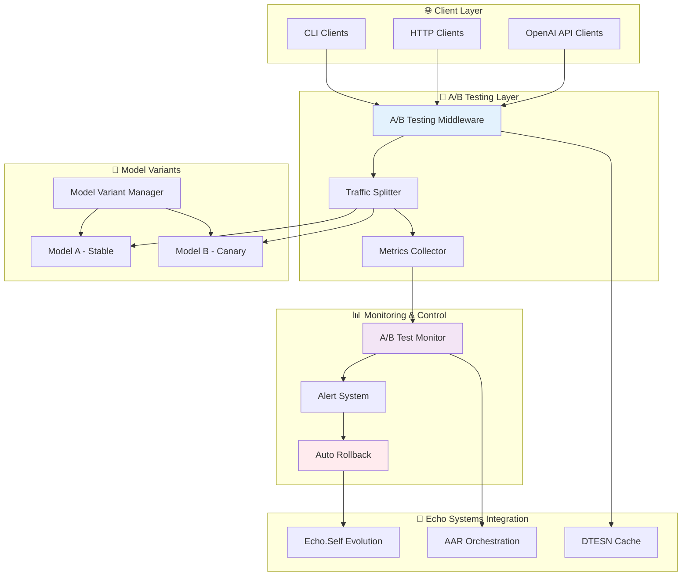
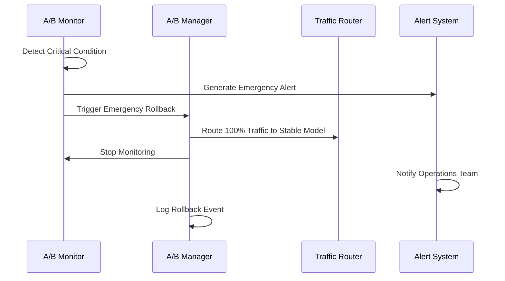

# A/B Testing Framework for Aphrodite Engine
**Phase 8 - SSR-Focused MLOps & Production Observability**

## Overview

The A/B Testing Framework provides comprehensive server-side model variant testing capabilities for the Aphrodite Engine, enabling safe deployment and performance comparison of model improvements with automated rollback mechanisms.

### Key Features

- **🔄 Traffic Splitting**: Intelligent request routing between model variants
- **📊 Performance Comparison**: Real-time metrics collection and analysis  
- **🛡️ Automated Rollback**: Immediate rollback on performance degradation
- **🎯 Model Variant Management**: Dynamic loading and management of multiple models
- **📈 Monitoring & Alerting**: Continuous health monitoring with automated alerts
- **🔧 Integration Ready**: Seamless integration with existing DTESN and AAR systems

## Architecture



## Quick Start

### 1. Start an A/B Test

```bash
curl -X POST http://localhost:2242/v1/ab-testing/start \
  -H "Content-Type: application/json" \
  -H "Authorization: Bearer your-api-key" \
  -d '{
    "model_a": "meta-llama/Meta-Llama-3.1-8B-Instruct",
    "model_b": "meta-llama/Meta-Llama-3.1-8B-Instruct-v2",
    "traffic_split_percent": 10.0,
    "test_duration_minutes": 60,
    "auto_rollback": true
  }'
```

### 2. Monitor Test Status

```bash
curl http://localhost:2242/v1/ab-testing/status \
  -H "Authorization: Bearer your-api-key"
```

### 3. Start Automated Monitoring

```bash
curl -X POST http://localhost:2242/v1/ab-testing/monitoring/start \
  -H "Authorization: Bearer your-api-key"
```

### 4. Stop Test and Get Results

```bash
curl -X POST http://localhost:2242/v1/ab-testing/stop \
  -H "Authorization: Bearer your-api-key"
```

## API Reference

### Core Endpoints

| Endpoint | Method | Description |
|----------|---------|-------------|
| `/v1/ab-testing/start` | POST | Start new A/B test |
| `/v1/ab-testing/status` | GET | Get current test status |
| `/v1/ab-testing/stop` | POST | Stop test and get results |
| `/v1/ab-testing/rollback` | POST | Emergency rollback |
| `/v1/ab-testing/traffic-split` | PATCH | Update traffic split |
| `/v1/ab-testing/config` | GET | Get configuration |
| `/v1/ab-testing/history` | GET | Get test history |

### Monitoring Endpoints

| Endpoint | Method | Description |
|----------|---------|-------------|
| `/v1/ab-testing/monitoring/status` | GET | Get monitoring status |
| `/v1/ab-testing/monitoring/alerts` | GET | Get monitoring alerts |
| `/v1/ab-testing/monitoring/start` | POST | Start automated monitoring |
| `/v1/ab-testing/monitoring/stop` | POST | Stop monitoring |

### Request/Response Examples

#### Start A/B Test Request
```json
{
  "model_a": "meta-llama/Meta-Llama-3.1-8B-Instruct",
  "model_b": "meta-llama/Meta-Llama-3.1-8B-Instruct-optimized",
  "traffic_split_percent": 15.0,
  "test_duration_minutes": 120,
  "auto_rollback": true,
  "success_criteria": {
    "min_improvement_threshold": 5.0,
    "max_error_rate_increase_percent": 30.0,
    "max_latency_increase_percent": 15.0
  },
  "failure_criteria": {
    "max_error_rate_percent": 4.0,
    "max_latency_ms": 3000.0
  }
}
```

#### Test Status Response
```json
{
  "test_id": "ab_test_1704067200",
  "status": "running",
  "elapsed_minutes": 45.2,
  "traffic_split_percent": 15.0,
  "metrics": {
    "variant_a": {
      "request_count": 8500,
      "error_rate": 2.1,
      "avg_latency_ms": 124.5,
      "successful_requests": 8320
    },
    "variant_b": {
      "request_count": 1500,
      "error_rate": 1.8,
      "avg_latency_ms": 118.3,
      "successful_requests": 1473
    }
  },
  "models": {
    "variant_a": "meta-llama/Meta-Llama-3.1-8B-Instruct",
    "variant_b": "meta-llama/Meta-Llama-3.1-8B-Instruct-optimized"
  }
}
```

#### Test Results Response
```json
{
  "test_id": "ab_test_1704067200",
  "status": "completed",
  "decision": "promote_b",
  "reason": "Variant B meets success criteria",
  "metrics_summary": {
    "variant_a": {
      "error_rate": 2.1,
      "avg_latency_ms": 124.5,
      "request_count": 8500
    },
    "variant_b": {
      "error_rate": 1.8,
      "avg_latency_ms": 118.3,
      "request_count": 1500
    }
  },
  "start_time": "2025-01-01T12:00:00Z",
  "end_time": "2025-01-01T14:00:00Z"
}
```

## Configuration

### YAML Configuration File

```yaml
# configs/ab_testing_config.yaml
ab_testing:
  enabled: true
  default_traffic_split_percent: 10.0
  max_test_duration_minutes: 1440
  
  success_criteria:
    min_improvement_threshold: 5.0
    max_error_rate_increase_percent: 50.0
    max_latency_increase_percent: 20.0
    min_sample_size: 100
  
  failure_criteria:
    max_error_rate_percent: 5.0
    max_latency_ms: 5000.0
    max_consecutive_errors: 10

monitoring:
  enabled: true
  check_interval_seconds: 30
  thresholds:
    critical_error_rate: 10.0
    warning_error_rate: 5.0
    critical_latency_ms: 3000.0
    warning_latency_ms: 1500.0
```

### Environment Variables

```bash
# Enable A/B testing
export APHRODITE_AB_TESTING_ENABLED=true
export APHRODITE_AB_TESTING_CONFIG_PATH=/path/to/ab_testing_config.yaml

# Traffic split configuration
export AB_TEST_DEFAULT_SPLIT_PERCENT=10.0
export AB_TEST_MAX_DURATION_MINUTES=720

# Monitoring configuration
export AB_TEST_MONITORING_INTERVAL=30
export AB_TEST_ALERT_RETENTION=1000
```

## Integration with Echo Systems

The A/B Testing Framework is designed to work seamlessly with the existing Echo systems architecture:

### DTESN Integration
```python
# Automatic DTESN cache optimization based on A/B test results
if test_result.decision == "promote_b":
    dtesn_cache.optimize_for_model(test_result.model_b)
    logger.info(f"DTESN cache optimized for {test_result.model_b}")
```

### AAR Orchestration
```python
# Multi-agent coordination for A/B test management
aar_orchestrator.coordinate_ab_test(
    test_id=test_id,
    agents=["monitoring_agent", "rollback_agent", "metrics_agent"]
)
```

### Echo.Self Evolution
```python
# Automatic model evolution based on A/B test insights
if test_result.decision == "promote_b":
    echo_self.evolve_architecture(
        base_model=test_result.model_a,
        improved_model=test_result.model_b,
        performance_gain=test_result.performance_improvement
    )
```

## Automated Rollback Mechanisms

### Rollback Triggers

1. **Critical Error Rate**: Error rate > 10%
2. **Critical Latency**: Average latency > 3000ms
3. **Performance Degradation**: 5x error rate increase or 100% latency increase
4. **Monitoring Failure**: 5 consecutive monitoring check failures
5. **Manual Emergency**: Operator-triggered emergency rollback

### Rollback Process



### Rollback Types

| Type | Trigger | Action | Recovery |
|------|---------|---------|----------|
| **Emergency** | Critical metrics | Immediate 100% traffic to stable | Manual investigation |
| **Gradual** | Warning metrics | Reduce traffic to variant B | Automatic retry |
| **Manual** | Operator decision | Configurable rollback speed | Operator controlled |
| **Scheduled** | Time-based | Planned rollback at specific time | Automatic |

## Monitoring and Alerting

### Alert Levels

- **INFO**: Informational events (test start/stop, configuration changes)
- **WARNING**: Performance degradation within acceptable limits
- **CRITICAL**: Performance degradation requiring attention
- **EMERGENCY**: Immediate rollback required

### Metrics Tracked

#### Performance Metrics
- Request count per variant
- Error rate (percentage)
- Average latency (milliseconds)
- Success rate (percentage)
- Throughput (requests/second)

#### Health Metrics
- Model loading success/failure
- Memory usage per variant
- GPU utilization per variant
- Response time distribution

#### Business Metrics
- User satisfaction scores
- Conversion rates (if applicable)
- Cost per request
- Resource efficiency

### Alert Destinations

```yaml
alerts:
  destinations:
    - type: slack
      webhook_url: https://hooks.slack.com/services/...
      channel: "#ml-ops-alerts"
    
    - type: email
      recipients: ["ml-team@company.com"]
      smtp_server: smtp.company.com
    
    - type: pagerduty
      integration_key: "your-pagerduty-key"
      severity_mapping:
        CRITICAL: "error"
        EMERGENCY: "critical"
    
    - type: prometheus
      pushgateway_url: http://pushgateway:9091
      job_name: "aphrodite-ab-testing"
```

## Best Practices

### Traffic Split Strategy

1. **Conservative Start**: Begin with 1-5% traffic to new variant
2. **Gradual Increase**: Increase traffic split based on confidence
3. **Monitor Closely**: Watch metrics for first 100+ requests
4. **Quick Rollback**: Be ready to rollback at first sign of issues

### Test Duration Guidelines

| Model Change Type | Recommended Duration | Traffic Split |
|-------------------|---------------------|---------------|
| **Bug Fix** | 30-60 minutes | 10-25% |
| **Performance Optimization** | 2-4 hours | 5-15% |
| **Model Update** | 4-24 hours | 1-10% |
| **Architecture Change** | 24-72 hours | 1-5% |

### Success Criteria Configuration

```yaml
# Conservative criteria for high-stakes deployments
conservative_criteria:
  min_improvement_threshold: 10.0
  max_error_rate_increase_percent: 25.0
  max_latency_increase_percent: 10.0
  min_sample_size: 1000

# Aggressive criteria for rapid iteration
aggressive_criteria:
  min_improvement_threshold: 2.0
  max_error_rate_increase_percent: 100.0
  max_latency_increase_percent: 50.0
  min_sample_size: 50
```

## Security Considerations

### API Security
- **Authentication**: All A/B testing endpoints require API key authentication
- **Authorization**: Role-based access control for A/B test operations
- **Rate Limiting**: Prevent abuse of A/B testing APIs
- **Audit Logging**: Complete audit trail of all A/B testing operations

### Model Security
- **Model Validation**: Verify model integrity before loading
- **Access Control**: Restrict model loading to authorized sources
- **Resource Limits**: Prevent resource exhaustion attacks
- **Monitoring**: Continuous monitoring for anomalous behavior

### Data Privacy
- **Request Anonymization**: Remove PII from A/B test logs
- **Metrics Aggregation**: Store only aggregated metrics, not individual requests
- **Retention Policies**: Automatic cleanup of old test data
- **Compliance**: GDPR/CCPA compliance for test data

## Troubleshooting

### Common Issues

#### Test Won't Start
```bash
# Check if another test is running
curl http://localhost:2242/v1/ab-testing/status

# Check model availability
curl http://localhost:2242/v1/models

# Check configuration
curl http://localhost:2242/v1/ab-testing/config
```

#### Unexpected Rollback
```bash
# Check monitoring alerts
curl http://localhost:2242/v1/ab-testing/monitoring/alerts

# Review test history
curl http://localhost:2242/v1/ab-testing/history

# Check system logs
tail -f /tmp/ab_test.log
```

#### Performance Issues
```bash
# Monitor variant health
curl http://localhost:2242/v1/ab-testing/status

# Check resource usage
nvidia-smi  # For GPU usage
htop        # For CPU/Memory usage

# Adjust traffic split
curl -X PATCH http://localhost:2242/v1/ab-testing/traffic-split \
  -d '{"traffic_split_percent": 5.0}'
```

### Debug Mode

Enable debug logging for detailed troubleshooting:

```bash
export APHRODITE_LOG_LEVEL=DEBUG
export AB_TEST_DEBUG=true
export AB_TEST_VERBOSE_METRICS=true
```

## Performance Tuning

### Optimization Guidelines

1. **Model Loading**: Pre-load frequently used variants
2. **Memory Management**: Monitor GPU memory usage during tests
3. **Batch Processing**: Optimize batch sizes for each variant
4. **Cache Management**: Leverage DTESN cache for performance

### Resource Planning

```yaml
# Resource requirements per concurrent model
resource_planning:
  gpu_memory_per_7b_model: "8GB"
  gpu_memory_per_13b_model: "16GB" 
  gpu_memory_per_70b_model: "80GB"
  
  cpu_cores_per_model: 4
  ram_per_model: "8GB"
  
  # Recommended maximums
  max_concurrent_7b_models: 4   # On A100-80GB
  max_concurrent_13b_models: 2  # On A100-80GB
  max_concurrent_70b_models: 1  # On A100-80GB
```

## Contributing

### Development Setup

```bash
# Clone repository
git clone https://github.com/EchoCog/aphroditecho.git
cd aphroditecho

# Install development dependencies
pip install -r requirements/dev.txt

# Run A/B testing tests
pytest tests/test_ab_testing_framework.py -v

# Run integration tests
pytest tests/integration/test_ab_testing_integration.py -v
```

### Code Standards

- Follow existing code style and patterns
- Add comprehensive tests for new features
- Update documentation for any API changes
- Ensure all tests pass before submitting PRs

---

**Built with ❤️ for the Aphrodite Engine ecosystem**

*For more information, see the [Technical Documentation Index](TECHNICAL_DOCUMENTATION_INDEX.md)*